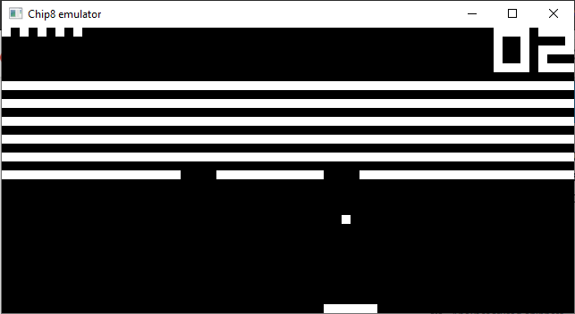

# Chip8 Emulator
This emulator is written in C++, using SDL2 for graphics, audio and keyboard input handling. 
My motivation for developing this emulator was mainly as an introductory project to learn C++,
as well as gaining experience with how emulation works, which I've been interested in for some time.



## Prerequisites 

#### Windows
- MSBuild, included in all [Visual Studio](https://visualstudio.microsoft.com/) editions.

- [CMake](https://cmake.org/) added to path.

- [SDL2 Development](https://www.libsdl.org/download-2.0.php) path added in **CMAKE_PREFIX_PATH** environment variable.
Also add a **sdl2-config.cmake** file in the SDL2/ folder, see [here](https://trenki2.github.io/blog/2017/06/02/using-sdl2-with-cmake/)
for an example on how to do this.

#### Linux
- CMake
- SDL2
- C++ compiler.

```bash
# For example:
$ sudo apt install cmake libsdl2-dev g++
```

## Building and compiling
```bash
# Build
$ cmake -S . -B build

# Compile
$ cmake --build build --config Release	
```

OR just launch the project in any IDE and it will recognize the cmake file ¯\\\_(ツ)\_/¯
## Usage
After compiling the executable and roms can be found in the *bin/* folder. There's only 4 roms included,
but more can be found by googling. 

The emulator takes a few optional parameters: **rom name**, 
**instruction cycles per second**, **window size**. The default values for these
parameters are **breakout.ch8**, **600** and **10** respectively.
```
Chip8 [filename] [-S cycles-per-second] [-W window-size]
```

```bash
# Example usage

$ cd bin

# Example 1: Default values
$ Chip8

# Example 2: custom parameters
$ Chip8 Tetris.ch8 -S 1000 -W 15

```


While playing the emulator you can press **m** to mute the game, and **p** to pause the game.

## Resources
- [High level Chip8 guide](https://tobiasvl.github.io/blog/write-a-chip-8-emulator/).
- [Kiwi8](https://github.com/tomdaley92/kiwi-8), used for SDL2 audio inspiration.
- [Using SDL2 with CMake](https://trenki2.github.io/blog/2017/06/02/using-sdl2-with-cmake/).

## License

This Chip8 emulator is available under the MIT license. See the [LICENSE](LICENSE) file for more info.